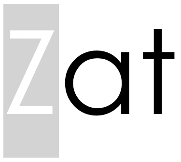

---

Zat from factorization, is a **free**, **smart parsed** and **half-open-source** programming language.
## Free language
Of course, like almost every programming languages, Zat is free. It is entirely financed by its own members (from Onagan), 
so if you would like to give something back by helping with the running costs then any donations are gratefully received.

## Smart parsed language
The parser converts every operations into a serialized [SAT problem](https://en.wikipedia.org/wiki/Boolean_satisfiability_problem).
Once your code has been serialized into a .ZAT file, you can run it on your terminal.
## Half-open-source language
Almost all of the code is open-source, except the SAT resolution algorithm which is kept secret, like the Coca-cola recipes.
## Progress
- [x] Grammar and syntax (coming soon on the wiki)
- [x] SAT solver (hiden)
    - [x] algorithm
    - [x] intern constraints serialization
    - [x] extern constraints
- [ ] Parser
    - [ ] basic operations to CNF
    
Going on with our project, next steps will follow.
    
## We need help
You want to develop your Python skills ? We need you. Contact us here : flbperiat@gmail.com
